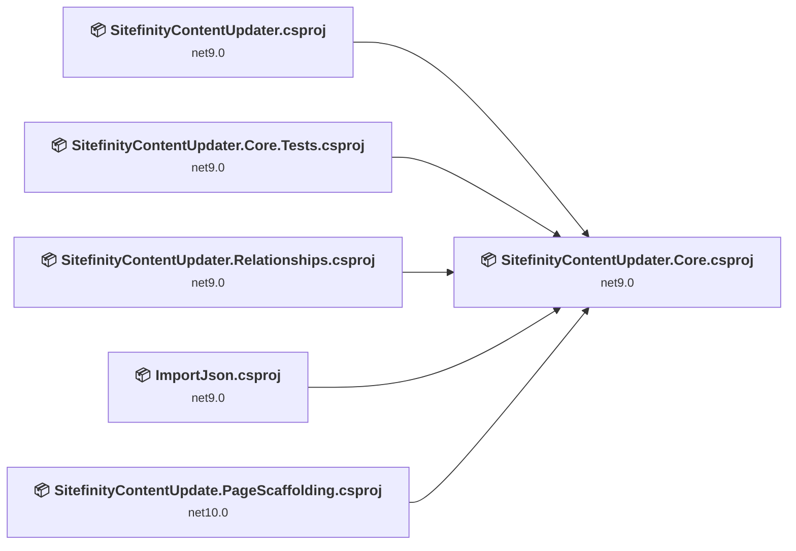
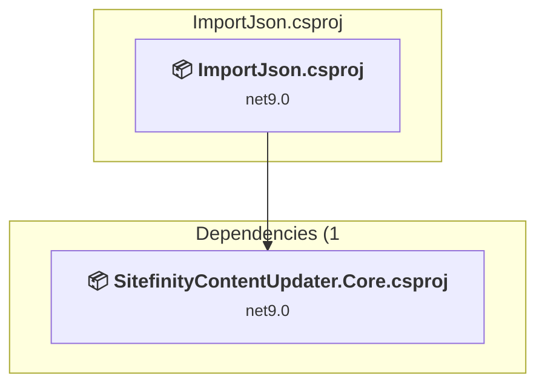
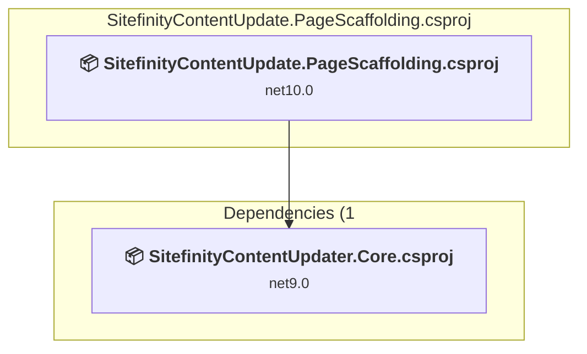
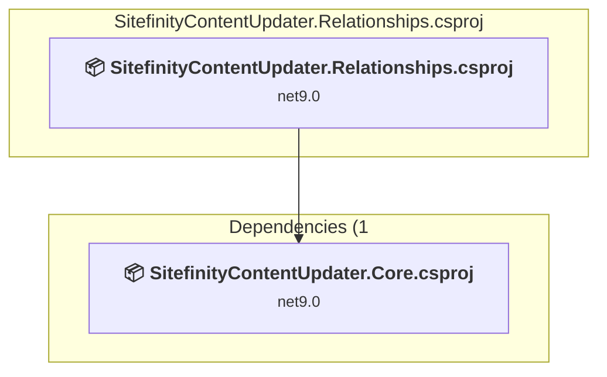
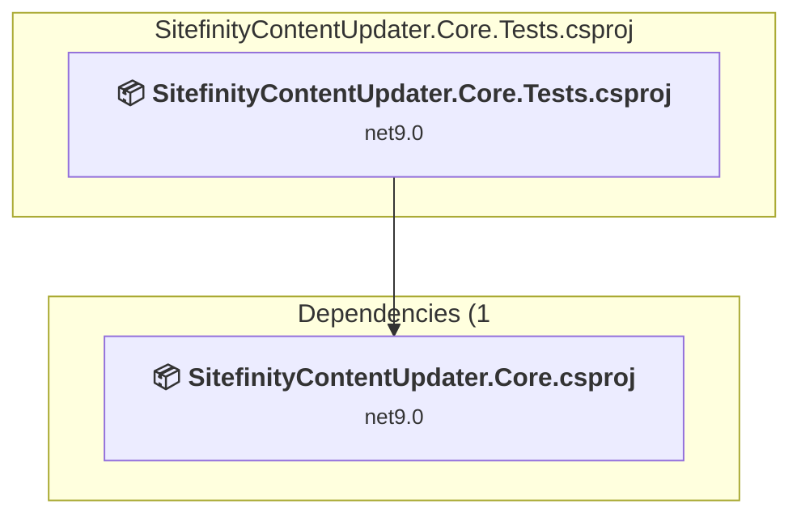
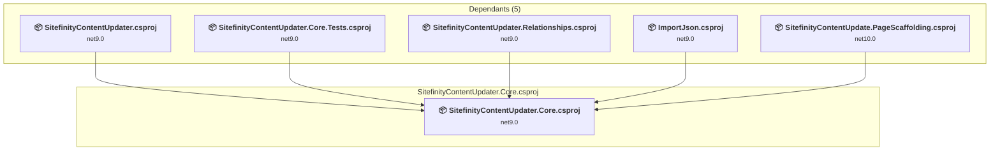
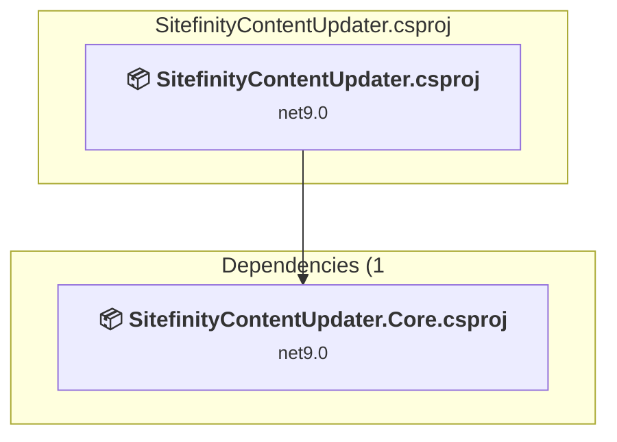

# Projects and dependencies analysis

This document provides a comprehensive overview of the projects and their dependencies in the context of upgrading to .NETCoreApp,Version=v10.0.

## Table of Contents

- [Executive Summary](#executive-Summary)
  - [Highlevel Metrics](#highlevel-metrics)
  - [Projects Compatibility](#projects-compatibility)
  - [Package Compatibility](#package-compatibility)
  - [API Compatibility](#api-compatibility)
- [Aggregate NuGet packages details](#aggregate-nuget-packages-details)
- [Top API Migration Challenges](#top-api-migration-challenges)
  - [Technologies and Features](#technologies-and-features)
  - [Most Frequent API Issues](#most-frequent-api-issues)
- [Projects Relationship Graph](#projects-relationship-graph)
- [Project Details](#project-details)

  - [ImportJson\ImportJson.csproj](#importjsonimportjsoncsproj)
  - [SitefinityContentUpdate.PageScaffolding\SitefinityContentUpdate.PageScaffolding.csproj](#sitefinitycontentupdatepagescaffoldingsitefinitycontentupdatepagescaffoldingcsproj)
  - [SitefinityContentUpdater.Relationships\SitefinityContentUpdater.Relationships.csproj](#sitefinitycontentupdaterrelationshipssitefinitycontentupdaterrelationshipscsproj)
  - [SitefinityUpdater.Core.Tests\SitefinityContentUpdater.Core.Tests.csproj](#sitefinityupdatercoretestssitefinitycontentupdatercoretestscsproj)
  - [SitefinityUpdater.Core\SitefinityContentUpdater.Core.csproj](#sitefinityupdatercoresitefinitycontentupdatercorecsproj)
  - [SitefinityUpdater\SitefinityContentUpdater.csproj](#sitefinityupdatersitefinitycontentupdatercsproj)

## Executive Summary

### Highlevel Metrics

| Metric | Count | Status |
| :--- | :---: | :--- |
| Total Projects | 6 | 5 require upgrade |
| Total NuGet Packages | 12 | 3 need upgrade |
| Total Code Files | 29 |  |
| Total Code Files with Incidents | 8 |  |
| Total Lines of Code | 6622 |  |
| Total Number of Issues | 60 |  |
| Estimated LOC to modify | 48+ | at least 0.7% of codebase |

### Projects Compatibility

| Project | Target Framework | Difficulty | Package Issues | API Issues | Est. LOC Impact | Description |
| :--- | :---: | :---: | :---: | :---: | :---: | :--- |
| [ImportJson\ImportJson.csproj](#importjsonimportjsoncsproj) | net9.0 | 🟢 Low | 0 | 2 | 2+ | DotNetCoreApp, Sdk Style = True |
| [SitefinityContentUpdate.PageScaffolding\SitefinityContentUpdate.PageScaffolding.csproj](#sitefinitycontentupdatepagescaffoldingsitefinitycontentupdatepagescaffoldingcsproj) | net10.0 | ✅ None | 0 | 0 |  | DotNetCoreApp, Sdk Style = True |
| [SitefinityContentUpdater.Relationships\SitefinityContentUpdater.Relationships.csproj](#sitefinitycontentupdaterrelationshipssitefinitycontentupdaterrelationshipscsproj) | net9.0 | 🟢 Low | 0 | 0 |  | DotNetCoreApp, Sdk Style = True |
| [SitefinityUpdater.Core.Tests\SitefinityContentUpdater.Core.Tests.csproj](#sitefinityupdatercoretestssitefinitycontentupdatercoretestscsproj) | net9.0 | 🟢 Low | 3 | 43 | 43+ | DotNetCoreApp, Sdk Style = True |
| [SitefinityUpdater.Core\SitefinityContentUpdater.Core.csproj](#sitefinityupdatercoresitefinitycontentupdatercorecsproj) | net9.0 | 🟢 Low | 2 | 3 | 3+ | ClassLibrary, Sdk Style = True |
| [SitefinityUpdater\SitefinityContentUpdater.csproj](#sitefinityupdatersitefinitycontentupdatercsproj) | net9.0 | 🟢 Low | 2 | 0 |  | DotNetCoreApp, Sdk Style = True |

### Package Compatibility

| Status | Count | Percentage |
| :--- | :---: | :---: |
| ✅ Compatible | 9 | 75.0% |
| ⚠️ Incompatible | 1 | 8.3% |
| 🔄 Upgrade Recommended | 2 | 16.7% |
| ***Total NuGet Packages*** | ***12*** | ***100%*** |

### API Compatibility

| Category | Count | Impact |
| :--- | :---: | :--- |
| 🔴 Binary Incompatible | 0 | High - Require code changes |
| 🟡 Source Incompatible | 0 | Medium - Needs re-compilation and potential conflicting API error fixing |
| 🔵 Behavioral change | 48 | Low - Behavioral changes that may require testing at runtime |
| ✅ Compatible | 9120 |  |
| ***Total APIs Analyzed*** | ***9168*** |  |

## Aggregate NuGet packages details

| Package | Current Version | Suggested Version | Projects | Description |
| :--- | :---: | :---: | :--- | :--- |
| AngleSharp | 1.4.0 |  | [SitefinityContentUpdater.Core.csproj](#sitefinityupdatercoresitefinitycontentupdatercorecsproj) [SitefinityContentUpdater.csproj](#sitefinityupdatersitefinitycontentupdatercsproj) | ✅Compatible |
| coverlet.collector | 6.0.2 |  | [SitefinityContentUpdater.Core.Tests.csproj](#sitefinityupdatercoretestssitefinitycontentupdatercoretestscsproj) | ✅Compatible |
| CsvHelper | 33.1.0 |  | [SitefinityContentUpdater.Core.csproj](#sitefinityupdatercoresitefinitycontentupdatercorecsproj) [SitefinityContentUpdater.csproj](#sitefinityupdatersitefinitycontentupdatercsproj) | ✅Compatible |
| FluentAssertions | 6.12.2 |  | [SitefinityContentUpdater.Core.Tests.csproj](#sitefinityupdatercoretestssitefinitycontentupdatercoretestscsproj) | ✅Compatible |
| JunitXml.TestLogger | 7.1.0 |  | [SitefinityContentUpdater.Core.Tests.csproj](#sitefinityupdatercoretestssitefinitycontentupdatercoretestscsproj) | ✅Compatible |
| Microsoft.Extensions.Configuration | 9.0.0 | 10.0.10 | [SitefinityContentUpdater.Core.csproj](#sitefinityupdatercoresitefinitycontentupdatercorecsproj) [SitefinityContentUpdater.Core.Tests.csproj](#sitefinityupdatercoretestssitefinitycontentupdatercoretestscsproj) [SitefinityContentUpdater.csproj](#sitefinityupdatersitefinitycontentupdatercsproj) | NuGet package upgrade is recommended |
| Microsoft.Extensions.Configuration.Json | 9.0.0 | 10.0.10 | [SitefinityContentUpdater.Core.csproj](#sitefinityupdatercoresitefinitycontentupdatercorecsproj) [SitefinityContentUpdater.Core.Tests.csproj](#sitefinityupdatercoretestssitefinitycontentupdatercoretestscsproj) [SitefinityContentUpdater.csproj](#sitefinityupdatersitefinitycontentupdatercsproj) | NuGet package upgrade is recommended |
| Microsoft.NET.Test.Sdk | 17.12.0 |  | [SitefinityContentUpdater.Core.Tests.csproj](#sitefinityupdatercoretestssitefinitycontentupdatercoretestscsproj) | ✅Compatible |
| Moq | 4.20.72 |  | [SitefinityContentUpdater.Core.Tests.csproj](#sitefinityupdatercoretestssitefinitycontentupdatercoretestscsproj) | ✅Compatible |
| Progress.Sitefinity.RestSdk | 15.4.8622.28 |  | [SitefinityContentUpdater.Core.csproj](#sitefinityupdatercoresitefinitycontentupdatercorecsproj) [SitefinityContentUpdater.Core.Tests.csproj](#sitefinityupdatercoretestssitefinitycontentupdatercoretestscsproj) [SitefinityContentUpdater.csproj](#sitefinityupdatersitefinitycontentupdatercsproj) | ✅Compatible |
| xunit | 2.9.2 |  | [SitefinityContentUpdater.Core.Tests.csproj](#sitefinityupdatercoretestssitefinitycontentupdatercoretestscsproj) | ⚠️NuGet package is deprecated |
| xunit.runner.visualstudio | 2.8.2 |  | [SitefinityContentUpdater.Core.Tests.csproj](#sitefinityupdatercoretestssitefinitycontentupdatercoretestscsproj) | ✅Compatible |

## Top API Migration Challenges

### Technologies and Features

| Technology | Issues | Percentage | Migration Path |
| :--- | :---: | :---: | :--- |

### Most Frequent API Issues

| API | Count | Percentage | Category |
| :--- | :---: | :---: | :--- |
| T:System.Uri | 28 | 58.3% | Behavioral Change |
| M:System.Uri.#ctor(System.String) | 13 | 27.1% | Behavioral Change |
| T:System.Net.Http.HttpContent | 5 | 10.4% | Behavioral Change |
| T:System.Text.Json.JsonDocument | 2 | 4.2% | Behavioral Change |

## Projects Relationship Graph

Legend:
📦 SDK-style project
⚙️ Classic project

## Project Details

### ImportJson\ImportJson.csproj

#### Project Info

- **Current Target Framework:** net9.0
- **Proposed Target Framework:** net10.0
- **SDK-style**: True
- **Project Kind:** DotNetCoreApp
- **Dependencies**: 1
- **Dependants**: 0
- **Number of Files**: 1
- **Number of Files with Incidents**: 2
- **Lines of Code**: 978
- **Estimated LOC to modify**: 2+ (at least 0.2% of the project)

#### Dependency Graph

Legend:
📦 SDK-style project
⚙️ Classic project

### API Compatibility

| Category | Count | Impact |
| :--- | :---: | :--- |
| 🔴 Binary Incompatible | 0 | High - Require code changes |
| 🟡 Source Incompatible | 0 | Medium - Needs re-compilation and potential conflicting API error fixing |
| 🔵 Behavioral change | 2 | Low - Behavioral changes that may require testing at runtime |
| ✅ Compatible | 898 |  |
| ***Total APIs Analyzed*** | ***900*** |  |

### SitefinityContentUpdate.PageScaffolding\SitefinityContentUpdate.PageScaffolding.csproj

#### Project Info

- **Current Target Framework:** net10.0✅
- **SDK-style**: True
- **Project Kind:** DotNetCoreApp
- **Dependencies**: 1
- **Dependants**: 0
- **Number of Files**: 1
- **Lines of Code**: 216
- **Estimated LOC to modify**: 0+ (at least 0.0% of the project)

#### Dependency Graph

Legend:
📦 SDK-style project
⚙️ Classic project

### API Compatibility

| Category | Count | Impact |
| :--- | :---: | :--- |
| 🔴 Binary Incompatible | 0 | High - Require code changes |
| 🟡 Source Incompatible | 0 | Medium - Needs re-compilation and potential conflicting API error fixing |
| 🔵 Behavioral change | 0 | Low - Behavioral changes that may require testing at runtime |
| ✅ Compatible | 0 |  |
| ***Total APIs Analyzed*** | ***0*** |  |

### SitefinityContentUpdater.Relationships\SitefinityContentUpdater.Relationships.csproj

#### Project Info

- **Current Target Framework:** net9.0
- **Proposed Target Framework:** net10.0
- **SDK-style**: True
- **Project Kind:** DotNetCoreApp
- **Dependencies**: 1
- **Dependants**: 0
- **Number of Files**: 1
- **Number of Files with Incidents**: 1
- **Lines of Code**: 138
- **Estimated LOC to modify**: 0+ (at least 0.0% of the project)

#### Dependency Graph

Legend:
📦 SDK-style project
⚙️ Classic project

### API Compatibility

| Category | Count | Impact |
| :--- | :---: | :--- |
| 🔴 Binary Incompatible | 0 | High - Require code changes |
| 🟡 Source Incompatible | 0 | Medium - Needs re-compilation and potential conflicting API error fixing |
| 🔵 Behavioral change | 0 | Low - Behavioral changes that may require testing at runtime |
| ✅ Compatible | 98 |  |
| ***Total APIs Analyzed*** | ***98*** |  |

### SitefinityUpdater.Core.Tests\SitefinityContentUpdater.Core.Tests.csproj

#### Project Info

- **Current Target Framework:** net9.0
- **Proposed Target Framework:** net10.0
- **SDK-style**: True
- **Project Kind:** DotNetCoreApp
- **Dependencies**: 1
- **Dependants**: 0
- **Number of Files**: 19
- **Number of Files with Incidents**: 2
- **Lines of Code**: 3616
- **Estimated LOC to modify**: 43+ (at least 1.2% of the project)

#### Dependency Graph

Legend:
📦 SDK-style project
⚙️ Classic project

### API Compatibility

| Category | Count | Impact |
| :--- | :---: | :--- |
| 🔴 Binary Incompatible | 0 | High - Require code changes |
| 🟡 Source Incompatible | 0 | Medium - Needs re-compilation and potential conflicting API error fixing |
| 🔵 Behavioral change | 43 | Low - Behavioral changes that may require testing at runtime |
| ✅ Compatible | 6358 |  |
| ***Total APIs Analyzed*** | ***6401*** |  |

### SitefinityUpdater.Core\SitefinityContentUpdater.Core.csproj

#### Project Info

- **Current Target Framework:** net9.0
- **Proposed Target Framework:** net10.0
- **SDK-style**: True
- **Project Kind:** ClassLibrary
- **Dependencies**: 0
- **Dependants**: 5
- **Number of Files**: 10
- **Number of Files with Incidents**: 2
- **Lines of Code**: 1577
- **Estimated LOC to modify**: 3+ (at least 0.2% of the project)

#### Dependency Graph

Legend:
📦 SDK-style project
⚙️ Classic project

### API Compatibility

| Category | Count | Impact |
| :--- | :---: | :--- |
| 🔴 Binary Incompatible | 0 | High - Require code changes |
| 🟡 Source Incompatible | 0 | Medium - Needs re-compilation and potential conflicting API error fixing |
| 🔵 Behavioral change | 3 | Low - Behavioral changes that may require testing at runtime |
| ✅ Compatible | 1722 |  |
| ***Total APIs Analyzed*** | ***1725*** |  |

### SitefinityUpdater\SitefinityContentUpdater.csproj

#### Project Info

- **Current Target Framework:** net9.0
- **Proposed Target Framework:** net10.0
- **SDK-style**: True
- **Project Kind:** DotNetCoreApp
- **Dependencies**: 1
- **Dependants**: 0
- **Number of Files**: 1
- **Number of Files with Incidents**: 1
- **Lines of Code**: 97
- **Estimated LOC to modify**: 0+ (at least 0.0% of the project)

#### Dependency Graph

Legend:
📦 SDK-style project
⚙️ Classic project

### API Compatibility

| Category | Count | Impact |
| :--- | :---: | :--- |
| 🔴 Binary Incompatible | 0 | High - Require code changes |
| 🟡 Source Incompatible | 0 | Medium - Needs re-compilation and potential conflicting API error fixing |
| 🔵 Behavioral change | 0 | Low - Behavioral changes that may require testing at runtime |
| ✅ Compatible | 44 |  |
| ***Total APIs Analyzed*** | ***44*** |  |

